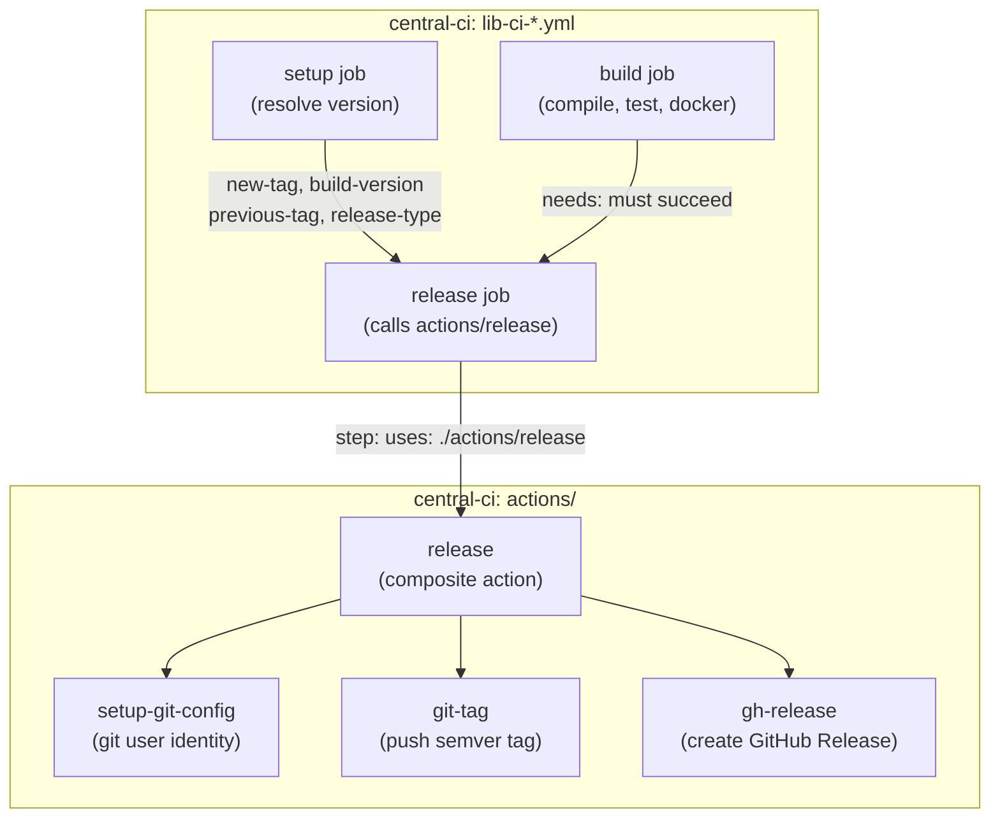

# Tag & Release Strategy for `lib-ci-*` Reusable Workflows

## Context

`central-ci` provides a family of reusable CI workflows consumed by every application repo:

| Workflow | Language |
| --- | --- |
| `lib-ci-dotnet.yml` | C# / .NET |
| `lib-ci-go.yml` | Go |
| `lib-ci-node.yml` | Node.js |
| `lib-ci-python.yml` | Python |
| `lib-ci-java.yml` | Java |

Every workflow shares the same two-job skeleton:

```text
setup  →  build
```

`setup` computes a version via:

```text
actions/setup → actions/resolve-version → actions/next-version → scripts/next-version.sh
```

`next-version.sh` reads `{service}/v*` (or plain `v*`) tags, walks commit history from the
last matching tag, and bumps semver from Conventional Commits.

**The gap:** the computed version labels Docker images and build artifacts but no git tag or
GitHub release is ever created. This document describes the strategy to close that gap across
**all** `lib-ci-*` workflows consistently.

---

## Problem Statement

Adding tag-and-release introduces risks that must be managed across every calling repo:

| Risk | Description |
| --- | --- |
| **Version collision** | Two concurrent runs compute the same next tag and both try to push it |
| **Tag on failed build** | A tag is created before or during a build that later fails |
| **Pipeline delay** | Serialising concurrent runs to prevent collisions slows team feedback |
| **Cross-repo interference** | Calling repos sharing a tag namespace corrupt each other's version history |
| **Code duplication** | Adding a release job to five separate workflows independently causes drift |

---

## Existing Safeguards

### Concurrency group (already in every `lib-ci-*` workflow)

```yaml
concurrency:
  group: ${{ github.event_name == 'pull_request' && github.run_id || format('{0}-main', inputs.app-name) }}
  cancel-in-progress: false
```

- **PR builds:** each run gets its own isolated group — fully parallel, never blocked.
- **`main` pushes (same service):** runs queue (`cancel-in-progress: false`).
  Run #1 completes and tags; run #2 then re-scans tags and computes the correct next version.
  **No race condition for the same service in the same repo.**

### Service-prefixed tags

`next-version.sh` scopes its `git tag -l` search to `{service}/v*` when a service name is
provided. Two services (`api`, `worker`) in the same monorepo produce independent namespaces
(`api/v1.2.3`, `worker/v0.4.1`). Git tag pushes for different names are atomic and never collide.

### Independent repos

Each calling repo has its own git tag database. `lib-ci-go.yml` running in Repo A and Repo B
simultaneously read and write to entirely separate tag namespaces.

---

## Race Condition Analysis

```text
Same service, same repo — queued by concurrency group:

 Push #1 ──► setup (api/v1.0.1) ──► build ──► release (tags api/v1.0.1) ──► done
                                                                                 │
 Push #2 ──────────────────────────────────── [queued] ──► setup (api/v1.0.2) ──► ...


Different services, same monorepo — parallel, different tag namespaces:

 Push ──► lib-ci-go    (api/v1.2.4)    ──► build ──► release → tags api/v1.2.4
      └── lib-ci-node  (worker/v0.5.0) ──► build ──► release → tags worker/v0.5.0
          (no collision — different tag prefixes)


Same service name, different repos — fully independent:

 Repo A ──► lib-ci-dotnet (payments/v2.1.0) ──► tags in Repo A's git
 Repo B ──► lib-ci-dotnet (payments/v1.0.3) ──► tags in Repo B's git
            (different repositories, no shared state)
```

---

## Strategy

### Why a composite action

Every shared behaviour in this repo lives in `actions/` as a composite action — `git-tag`,
`gh-release`, `setup-git-config`, `setup-docker`, and others all follow this pattern. Adding
release logic as a composite action keeps the call graph consistent, avoids introducing a
second abstraction layer (nested reusable workflows), and means the release behaviour is
maintained in one place regardless of how many `lib-ci-*` workflows consume it.

The alternative of inlining release steps directly into each workflow would require keeping
five copies of identical logic in sync. The alternative of a nested reusable workflow would
add a GitHub Actions scheduling round-trip per run and introduce a pattern inconsistent with
the rest of the repo.

### How it works

A new composite action `actions/release/action.yaml` wraps the three existing actions that
together constitute a release:

1. **`actions/setup-git-config`** — configures the git user identity so the runner can push
   tags back to the repo.
2. **`actions/git-tag`** — creates and pushes the semver tag (e.g. `api/v1.2.3`).
3. **`actions/gh-release`** — creates the GitHub Release, attaches it to the tag, and
   generates release notes from the commit range between `previous-tag` and `new-tag`.

Each `lib-ci-*` workflow gains a `release` job that calls this action as a single step.
The job declares `needs: [setup, build]`, which means:

- The tag is only pushed after both `setup` **and** `build` succeed. A failing build never
  produces a git tag or GitHub Release.
- The version values computed in `setup` (`new-tag`, `previous-tag`, `release-type`,
  `build-version`) flow directly into the `release` job via job outputs — no re-computation,
  no artifact round-trips.

PR builds are excluded entirely via `if: github.event_name != 'pull_request'` on the
`release` job, so the PR pipeline is unaffected.

### Architecture



### Data flow

The version values are computed once in `setup` and forwarded through job outputs:

```text
scripts/next-version.sh
        │
        ▼
actions/resolve-version          ← reads git tags, walks commits, bumps semver
        │  outputs: new-tag, build-version, previous-tag, release-type
        ▼
actions/setup                    ← passes outputs through at action level
        │  id: prep
        ▼
setup job (outputs:)             ← forwards at job level so other jobs can consume
  new-tag:      steps.prep.outputs.new-tag
  build-version: steps.prep.outputs.build-version
  previous-tag: steps.prep.outputs.previous-tag
  release-type: steps.prep.outputs.release-type
        │
        ▼
release job
  needs.setup.outputs.new-tag    → actions/release → actions/git-tag
  needs.setup.outputs.new-tag    → actions/release → actions/gh-release
  needs.setup.outputs.build-version   (release title)
  needs.setup.outputs.previous-tag    (release notes range)
  needs.setup.outputs.release-type    (passed to gh-release for label)
```

### Composite action definition

**`actions/release/action.yaml`:**

```yaml
name: "Release"
description: "Creates a git tag and GitHub release for a successful main-branch build"

inputs:
  new-tag:
    description: "Tag to create (e.g. api/v1.2.3)"
    required: true
  build-version:
    description: "Bare version for the release title (e.g. 1.2.3)"
    required: true
  previous-tag:
    description: "Previous tag for release notes range"
    required: false
    default: ""
  release-type:
    description: "Bump type: major, minor, patch"
    required: false
    default: ""
  token:
    description: "GitHub token with contents:write"
    required: true

runs:
  using: "composite"
  steps:
    - uses: actions/checkout@v4
      with:
        fetch-depth: 0

    - uses: mmastersvz/central-ci/actions/setup-git-config@main

    - uses: mmastersvz/central-ci/actions/git-tag@main
      with:
        new-tag: ${{ inputs.new-tag }}
        token: ${{ inputs.token }}

    - uses: mmastersvz/central-ci/actions/gh-release@main
      with:
        tag: ${{ inputs.new-tag }}
        title: ${{ inputs.build-version }}
        token: ${{ inputs.token }}
        generate-notes: "true"
        release-type: ${{ inputs.release-type }}
        previous-tag: ${{ inputs.previous-tag }}
```

### Release job added to each `lib-ci-*.yml`

```yaml
  release:
    name: "Tag and Release"
    runs-on: ubuntu-latest
    needs: [setup, build]
    if: github.event_name != 'pull_request'
    permissions:
      contents: write
    steps:
      - uses: mmastersvz/central-ci/actions/release@main
        with:
          new-tag:       ${{ needs.setup.outputs.new-tag }}
          build-version: ${{ needs.setup.outputs.build-version }}
          previous-tag:  ${{ needs.setup.outputs.previous-tag }}
          release-type:  ${{ needs.setup.outputs.release-type }}
          token:         ${{ secrets.github-token }}
```

`permissions: contents: write` is declared on the job rather than at the workflow level,
keeping the principle of least privilege visible: only the `release` job can write to the
repo; `setup` and `build` run with the default read-only `contents` permission.

---

## TODO

- [ ] Update `README.md` version examples to reflect that releases are now automatic on `main`

---

## References

- [GitHub Actions: composite actions](https://docs.github.com/en/actions/sharing-automations/creating-actions/creating-a-composite-action)
- [GitHub Actions: reusable workflows](https://docs.github.com/en/actions/sharing-automations/reusing-workflows)
- [GitHub Actions: concurrency](https://docs.github.com/en/actions/writing-workflows/choosing-what-your-workflow-does/control-the-concurrency-of-workflows-and-jobs)
- [Conventional Commits spec](https://www.conventionalcommits.org/)
- [`gh release create` docs](https://cli.github.com/manual/gh_release_create)
- [Git tag atomicity](https://git-scm.com/docs/git-push#Documentation/git-push.txt---atomic)
- `scripts/next-version.sh` — version computation, service-prefix logic
- `actions/resolve-version/action.yml` — PR vs release version routing
- `actions/git-tag/action.yml` — tag creation action
- `actions/gh-release/action.yml` — release creation action
- `actions/release/action.yaml` — composite action wrapping the above
- `.github/workflows/local-release.yml` — reference implementation for this repo's own releases
